# 💰 Expense Tracker

A Flutter-based personal finance management application designed to help users track income and expenses, manage budgets, monitor savings goals, and understand their spending habits.

The application follows an offline-first approach, allowing users to work with locally stored financial data and synchronize changes with the cloud when connectivity is available.

## 📱 Screenshots

### Dashboard

Get a quick overview of your balance, income, expenses, and recent transactions.

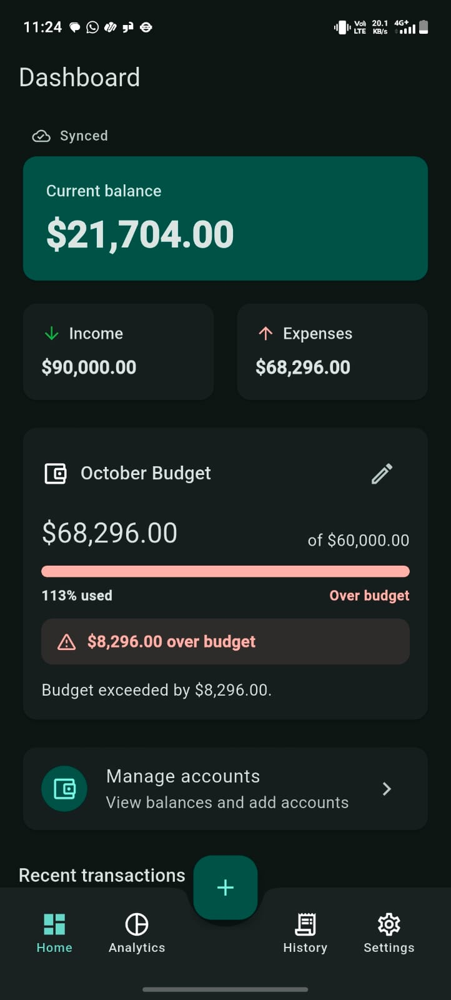

### Transactions

Manage and review your financial transactions.

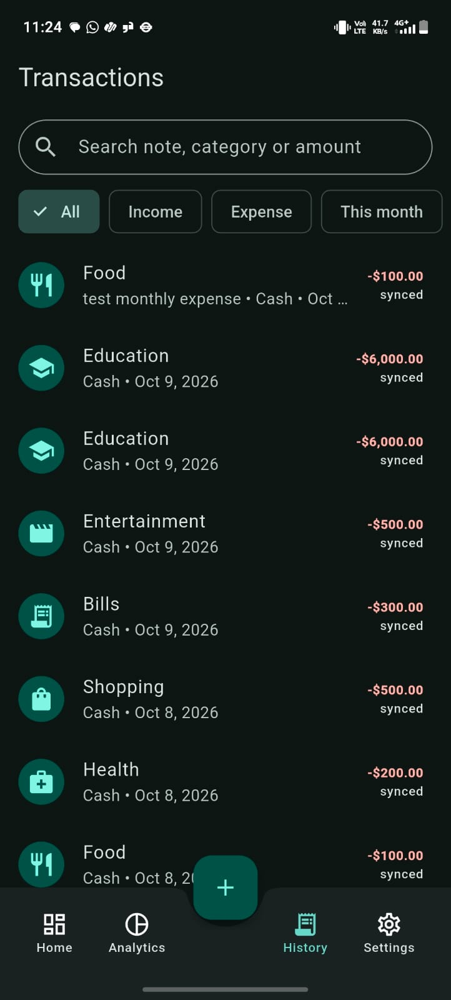

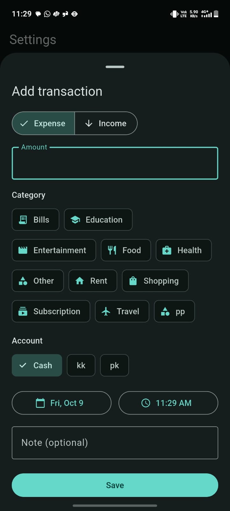

### Analytics & Smart Insights

Explore spending patterns and financial analytics.

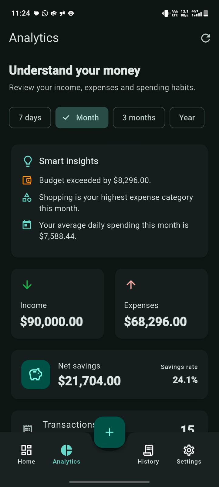

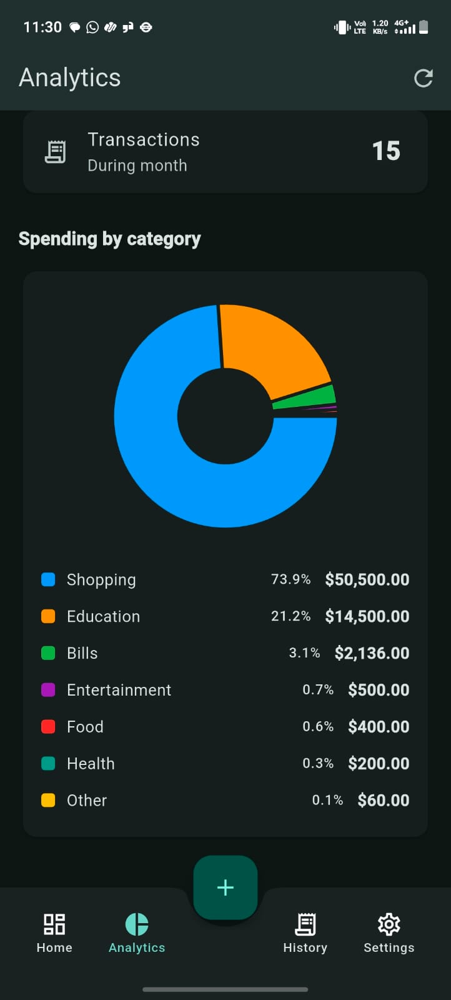

### Accounts

Manage your financial accounts and track their balances.

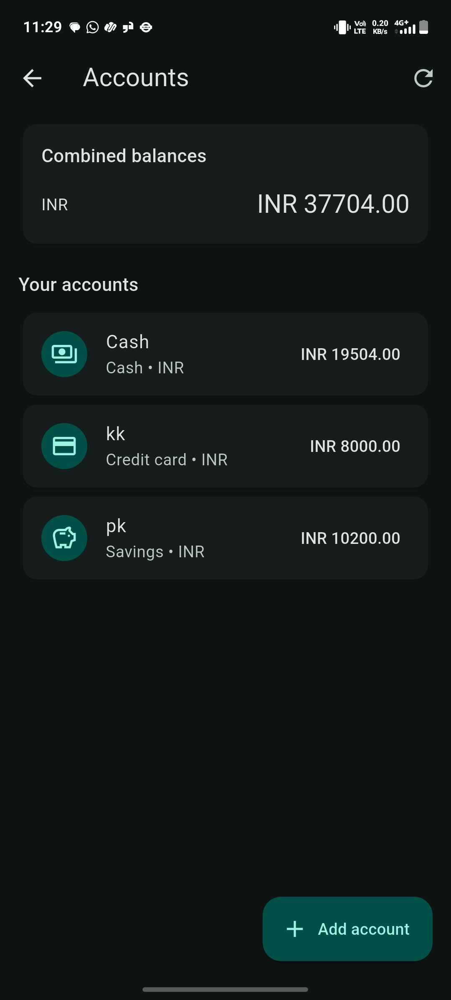

### Budgets

Monitor budgets and review spending progress.

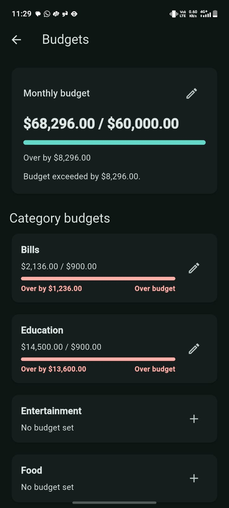

### Savings Goals

Create savings goals and track your progress.

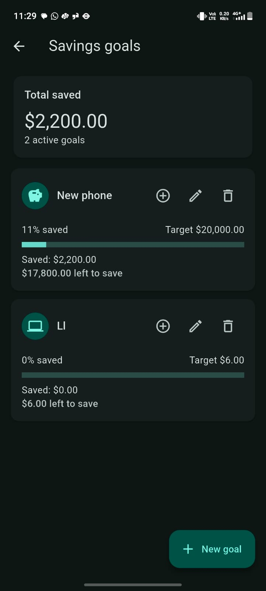

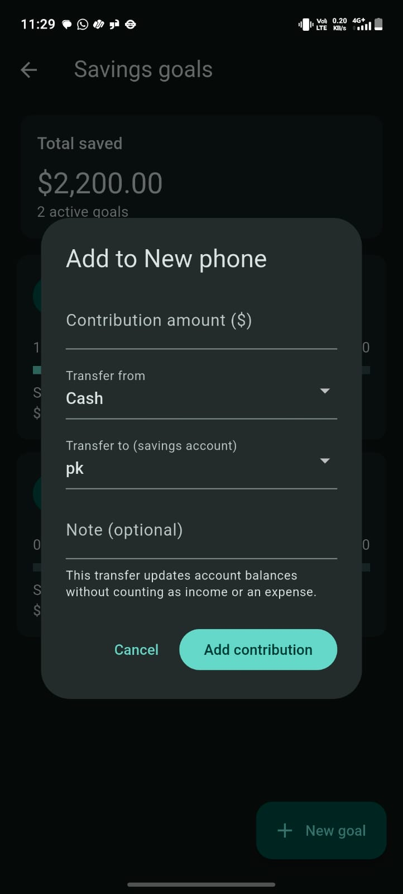

### Settings

Manage application preferences and settings.

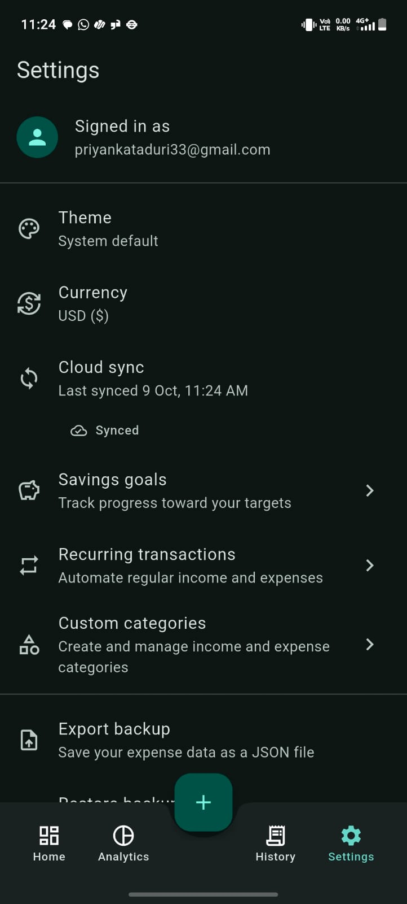

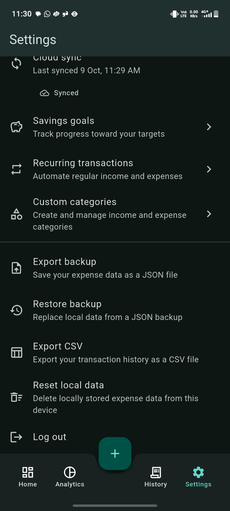

## ✨ Features

### 📊 Dashboard

* Overview of total balance, income, and expenses.
* Recent transaction activity.
* Monthly financial overview.
* Budget progress at a glance.

### 💸 Transaction Management

* Add, edit, and delete transactions.
* Record income and expenses.
* Organize transactions by category and account.
* Add transaction dates, notes, and other supported details.
* Search and filter transactions.
* Support recurring transactions.

### 🏦 Account Management

* Manage multiple financial accounts.
* View account balances.
* Track financial activity across accounts.

### 🎯 Budget Management

* Set and monitor budgets.
* Track spending against budget limits.
* View budget progress.

### 📈 Analytics & Smart Insights

* Visualize financial activity.
* Review spending patterns and category-wise expenses.
* Generate insights from financial data.

### 🎯 Savings Goals

* Create savings goals.
* Record contributions toward goals.
* Track progress toward savings targets.

### 🔄 Offline-First Experience

* Access locally stored data without an internet connection.
* Continue supported transaction operations offline.
* Preserve data locally across application restarts.
* Synchronize pending changes when connectivity returns, where cloud synchronization is configured.

### ⚙️ Additional Features

* Light and dark theme preferences.
* JSON backup and restore.
* CSV export.
* Recurring transaction support.
* Automated tests and continuous integration.

## 🛠️ Tech Stack

| Technology          | Purpose                                     |
| ------------------- | ------------------------------------------- |
| Flutter             | Cross-platform application development      |
| Dart                | Application programming language            |
| Provider            | State management using `ChangeNotifier`     |
| SQLite / Drift      | Local database and persistence              |
| Supabase / Firebase | Cloud services, where configured            |
| Flutter Test        | Unit and widget testing                     |
| GitHub Actions      | Automated analysis, testing, and APK builds |

## 🏗️ Architecture

The application uses a layered architecture to separate the user interface, state management, business logic, and data access.

```text
┌──────────────────────────────┐
│        Presentation          │
│       Flutter Screens        │
└──────────────┬───────────────┘
               │
               ▼
┌──────────────────────────────┐
│      State Management        │
│   Provider / ChangeNotifier  │
└──────────────┬───────────────┘
               │
               ▼
┌──────────────────────────────┐
│        Repositories          │
│   Data Access & Operations   │
└──────────────┬───────────────┘
               │
               ▼
┌──────────────────────────────┐
│       Local Database         │
│       SQLite / Drift         │
└──────────────┬───────────────┘
               │
               ▼
┌──────────────────────────────┐
│   Cloud Synchronization      │
│   Where Configured           │
└──────────────────────────────┘
```

The local database supports offline access. Cloud synchronization is intended to propagate local changes when connectivity is available.

## 📂 Project Structure

The following is a high-level overview; directory names may vary slightly in the repository.

```text
lib/
├── core/
│   └── utils/
├── data/
│   ├── local/
│   └── repositories/
├── features/
│   ├── analytics/
│   ├── budgets/
│   ├── recurring/
│   ├── savings/
│   ├── settings/
│   └── transactions/
├── providers/
└── main.dart

screenshots/
test/

.github/
└── workflows/
    └── flutter_ci.yml
```

## 🚀 Getting Started

### Prerequisites

Install the following tools:

* [Flutter SDK](https://docs.flutter.dev/get-started/install)
* [Dart SDK](https://dart.dev/get-dart)
* [Android Studio](https://developer.android.com/studio) or Visual Studio Code
* Git

### Installation

**1. Clone the repository**

```bash
git clone https://github.com/priyankataduri37-debug/expense_tracker.git
```

**2. Navigate to the project directory**

```bash
cd expense_tracker
```

**3. Install dependencies**

```bash
flutter pub get
```

**4. Run the application**

```bash
flutter run
```

If cloud services require configuration, add the appropriate project configuration and credentials locally before testing cloud-dependent functionality. Never commit private credentials or secret keys.

## 🧪 Testing

Run static analysis:

```bash
flutter analyze
```

Run the complete test suite:

```bash
flutter test
```

Run the recurring transaction tests:

```bash
flutter test test/recurrence_test.dart
```

The project includes automated tests for recurring transaction logic. Run the full suite to verify all tests available in the repository.

## 📦 Build the APK

To create a release APK, run:

```bash
flutter build apk --release
```

The generated APK will be located at:

```text
build/app/outputs/flutter-apk/app-release.apk
```

To create a smaller APK for different device architectures:

```bash
flutter build apk --split-per-abi
```

## 🔁 Continuous Integration

GitHub Actions is configured to run the following checks on pushes and pull requests:

* Install Flutter dependencies.
* Run `flutter analyze`.
* Run `flutter test`.
* Build the release APK.
* Upload the APK as a workflow artifact.

Check the [GitHub Actions workflow runs](https://github.com/priyankataduri37-debug/expense_tracker/actions) for build and test results.

## 📶 Offline Testing

To verify offline functionality:

1. Open the application while connected to the internet.
2. Turn off Wi-Fi and mobile data.
3. Add an expense.
4. Close and restart the application.
5. Verify that the expense remains available.
6. Restore the internet connection.
7. Verify that pending changes synchronize with the cloud, if cloud synchronization is configured.

## 🔐 Data & Privacy

Financial data should be handled carefully. Local persistence and cloud synchronization depend on the database and backend configuration included in the project.

If encrypted-at-rest storage is implemented, document the encryption mechanism and key management here. Avoid storing credentials, passwords, or encryption keys directly in the repository.

## 🛣️ Future Improvements

Potential areas for further development include:

* Expanded financial reports and insights.
* Improved transaction-list performance for large datasets.
* Additional currency support.
* More comprehensive synchronization conflict testing.
* Expanded integration and end-to-end tests.

## 👩‍💻 Author

**Expense Tracker — Flutter Application**

GitHub Repository: [priyankataduri37-debug/expense_tracker](https://github.com/priyankataduri37-debug/expense_tracker)

## 📄 License

Add a license to this project if you intend to distribute or reuse it under specific licensing terms.
